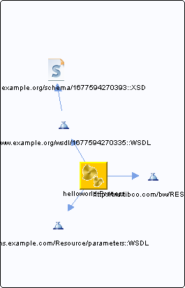

# Process.bwp {#Process.bwp .concept}

Chapter contains Process.bwp crossreferences documentation.

References To:

-   [http://www.example.org/wsdl/1677594270335::WSDL](../../../projects/HelloWorld/Service_Descriptors/Process.wsdl.md)
-   http://tns.tibco.com/bw/REST::WSDL
-   http://xmlns.example.com/Resource/parameters::WSDL

**Parent topic:**[Processes](../../../cross/dependencies/processes/processes.md)

