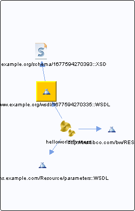

# Process.wsdl {#Process.wsdl .concept}

Chapter contains Process.wsdl crossreferences documentation.

Referenced From:

-   [helloworld.Process](../../../projects/HelloWorld/Processes/helloworld/Process.bwp.md)

References To:

-   [http://www.example.org/schema/1677594270393::XSD](../../../projects/HelloWorld/Schemas/ProcessSchema.xsd.md)

**Parent topic:**[WSDLs](../../../cross/dependencies/wsdls/wsdls.md)

