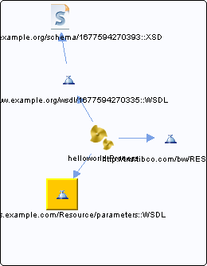

# http\_\_\_xmlns.example.com\_Resource\_parameters\_\_WSDL\_\_unresolved {#http___xmlns.example.com_Resource_parameters__WSDL__unresolved .concept}

Chapter contains http\_\_\_xmlns.example.com\_Resource\_parameters\_\_WSDL\_\_unresolved crossreferences documentation.

Referenced From:

-   [helloworld.Process](../../../projects/HelloWorld/Processes/helloworld/Process.bwp.md)

**Parent topic:**[WSDLs](../../../cross/dependencies/wsdls/wsdls.md)

