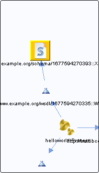

# ProcessSchema.xsd {#ProcessSchema.xsd .concept}

Chapter contains ProcessSchema.xsd crossreferences documentation.

Referenced From:

-   [http://www.example.org/wsdl/1677594270335::WSDL](../../../projects/HelloWorld/Service_Descriptors/Process.wsdl.md)

**Parent topic:**[XSDs](../../../cross/dependencies/xsds/xsds.md)

