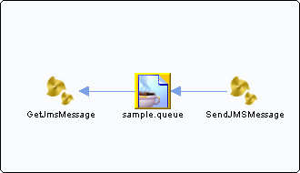

# sample.queue {#destsample.queue .concept}

Section contains list of middleware objects using “sample.queue”

-   **Project:** [EMS\_Play1](../projs/EMS_Play1.md)
    -   **Source:**BW Process [/GetJmsMessage](../../../projects/EMS_Play1/GetJmsMessage.process.md)
        -   **Activity:** [JMS Queue Receiver](../projs/act_22.md)
        -   **Action Type:**ReceiveRequest
        -   **Transport Type:**
    -   **Source:**BW Process [/SendJMSMessage](../../../projects/EMS_Play1/SendJMSMessage.process.md)
        -   **Activity:** [JMS Queue Sender](../projs/act_24.md)
        -   **Action Type:**Send
        -   **Transport Type:**

**Parent topic:**[Queues](../../../crossref/dest/msgs/Group_Id32.md)

