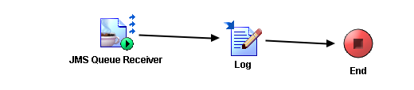

# GetJmsMessage {#ProcessMain .concept}

Section contains description of Process " GetJmsMessage.process " .

**Parent topic:**[Processes](../../projects/EMS_Play1/common/process.md)

## Folder description: {#FolderDescription}

|Folder|Description|
|------|-----------|
| |No description|

## Process description: {#ProcessDescription}

|No description|

## Process definition: {#ProcessDefinition}

Full process path: GetJmsMessage.process

## Diagram: {#Diagram}



## Process starter activity: {#Starter}

Name: JMS Queue Receiver

-   Property Name: **_JMS Queue Receiver_**
    -   Type: *com.tibco.plugin.jms.JMSQueueEventSource*
    -   Resource Type: *ae.activities.JMSQueueEventSource*
    -   Description:
    -   *Configuration:*
        -   PermittedMessageType = Text
        -   SessionAttributes
            -   transacted = false
            -   acknowledgeMode = 1 \(Auto\)
            -   maxSessions = 1
            -   destination = sample.queue
        -   ConfigurableHeaders
            -   JMSDeliveryMode = PERSISTENT
            -   JMSExpiration = 0
            -   JMSPriority = 4
        -   ConnectionReference = [/JMS Connection.sharedjmscon](JMS_Connection.sharedjmscon.md)

## Process end activity: {#EndActivity}

Name: End

## Activities: {#Activities}

### Name: **_Log_** {#Log}

-   Type: *com.tibco.pe.core.WriteToLogActivity*
-   Resource Type: *ae.activities.log*
-   Description:
-   *Configuration:*
    -   role = User
-   *Input bindings:*
    -   Mapping table

        |Target|Source|
        |------|------|
        |**/ActivityInput****/message**|concat\("Got Message: ", $JMS-Queue-Receiver/ns:ActivityOutput/Body\)|

    -   Mapping tree

        |Mapping|
        |-------|
        |        ```

**ActivityInput**
 **message** = concat("Got Message: ", $JMS-Queue-Receiver/ns:ActivityOutput/Body)
        ```

|

    -   Source code

        |Mapping|
        |-------|
        |        ```

            <ns2:ActivityInput xmlns:ns2="http://www.tibco.com/pe/WriteToLogActivitySchema" xmlns:xsl="http://www.w3.org/1999/XSL/Transform" xmlns:pd="http://xmlns.tibco.com/bw/process/2003" xmlns:ns="http://www.tibco.com/namespaces/tnt/plugins/jms">
                <message>
                    <xsl:value-of select="concat(&quot;Got Message: &quot;, $JMS-Queue-Receiver/ns:ActivityOutput/Body)"/>
                </message>
            </ns2:ActivityInput>
        
        ```

|


## Transitions: {#Transitions}

-   From: **_JMS Queue Receiver_** -To: **_Log_**
    -   Label:
    -   Condition: *Success*
    -   Description:

-   From: **_Log_** -To: **_End_**
    -   Label:
    -   Condition: *Success*
    -   Description:

