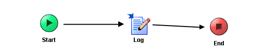

# HelloWorld {#ProcessMain .concept}

Section contains description of Process " HelloWorld.process " .

**Parent topic:**[Processes](../../projects/EMS_Play1/common/process.md)

## Folder description: {#FolderDescription}

|Folder|Description|
|------|-----------|
| |No description|

## Process description: {#ProcessDescription}

|No description|

## Process definition: {#ProcessDefinition}

Full process path: HelloWorld.process

## Diagram: {#Diagram}



## Process starter activity: {#Starter}

Name: Start

Description:

## Process end activity: {#EndActivity}

Name: End

## Activities: {#Activities}

### Name: **_Log_** {#Log}

-   Type: *com.tibco.pe.core.WriteToLogActivity*
-   Resource Type: *ae.activities.log*
-   Description:
-   *Configuration:*
    -   role = User
-   *Input bindings:*
    -   Mapping table

        |Target|Source|
        |------|------|
        |**/ActivityInput****/message**|"Hello World"|

    -   Mapping tree

        |Mapping|
        |-------|
        |        ```

**ActivityInput**
 **message** = "Hello World"
        ```

|

    -   Source code

        |Mapping|
        |-------|
        |        ```

            <ns:ActivityInput xmlns:ns="http://www.tibco.com/pe/WriteToLogActivitySchema" xmlns:xsl="http://www.w3.org/1999/XSL/Transform" xmlns:pd="http://xmlns.tibco.com/bw/process/2003">
                <message>
                    <xsl:value-of select="&quot;Hello World&quot;"/>
                </message>
            </ns:ActivityInput>
        
        ```

|


## Transitions: {#Transitions}

-   From: **_Log_** -To: **_End_**
    -   Label:
    -   Condition: *Success*
    -   Description:

-   From: **_Start_** -To: **_Log_**
    -   Label:
    -   Condition: *Success*
    -   Description:

