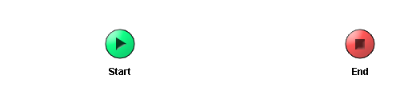

# Process Definition {#ProcessMain .concept}

Section contains description of Process " Process Definition.process " .

**Parent topic:**[Processes](../../projects/EMS_Play1/common/process.md)

## Folder description: {#FolderDescription}

|Folder|Description|
|------|-----------|
| |No description|

## Process description: {#ProcessDescription}

|No description|

## Process definition: {#ProcessDefinition}

Full process path: Process Definition.process

## Diagram: {#Diagram}

## Process starter activity: {#Starter}

Name: Start

Description:

## Process end activity: {#EndActivity}

Name: End

