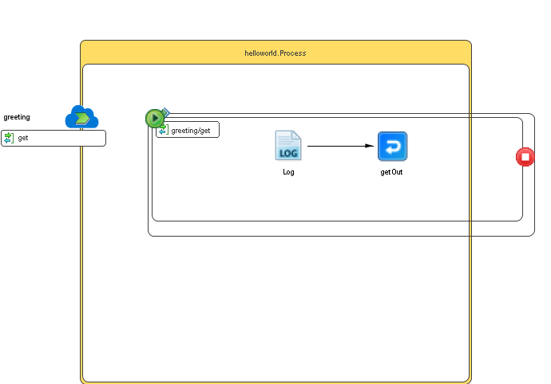

# Process {#ProcessMain .concept}

Section contains description of Process " Process.bwp " .

**Parent topic:**[Processes](../../../../projects/HelloWorld/common/process.md)

## Folder description: {#FolderDescription}

|Folder|Description|
|------|-----------|
| |No description|

## Process description: {#ProcessDescription}

|No description|

## Process definition: {#ProcessDefinition}

Full process path: helloworld.Process

## Diagram: {#Diagram}



## Process starter activity: {#Starter}

### Name: **_OnMessageStart_** {#OnMessageStart}

-   Constructor: onMessageStart
-   xpdlId: 4e51f188-4800-492b-bde2-2ef69962657d

## Process end activity: {#EndActivity}

### Name: **_OnMessageEnd_** {#OnMessageEnd}

-   Constructor: onMessageEnd
-   xpdlId: b0ae49e2-7995-4b81-bf12-0135922cd513

## Process properties: {#ProcessProperties}

|Name|Hot Update|Private Property|Shared Resource Type|Type|Property Source|
|----|----------|----------------|--------------------|----|---------------|
|KUB\_PROP|false|true| |xsd:string|[KUB\_MOD\_PROPERTY](#default:%20test,)|

## Activities: {#Activities}

### Name: **_getOut_** {#getOut}

-   Service: greeting / operation: get
-   ReplyWith: Output Message
-   Description:
-   *Input bindings:*
    -   Mapping table

        |Target|Source|
        |------|------|
        |**/tns:getResponse****/item**|concat\("Hello ", $get/parameters/tns2:greetingGetParameters/tns2:name, " From ", bw:getHostName\(\), " Version: ",bw:getModuleProperty\("BW.APPLICATION.VERSION"\), " Value: ", $KUB\_PROP \)|

    -   Mapping tree

        |Mapping|
        |-------|
        |        ```
**
	  tns:getResponse
		 item = **concat(&quot;Hello &quot;, $get/parameters/tns2:greetingGetParameters/tns2:name, &quot; From &quot;, bw:getHostName(), &quot; Version: &quot;,bw:getModuleProperty(&quot;BW.APPLICATION.VERSION&quot;), &quot; Value: &quot;,  $KUB_PROP )
        ```

|

    -   Source code

        |Mapping|
        |-------|
        |        ```
<?xml version="1.0" encoding="UTF-8"?><xsl:stylesheet xmlns:xsl="http://www.w3.org/1999/XSL/Transform" xmlns:tns="http://xmlns.example.com/20230228152332PLT" xmlns:tns2="http://xmlns.example.com/Resource/parameters" xmlns:bw="http://www.tibco.com/bw/xpath/bw-custom-functions" version="2.0">
   <xsl:param name="get"/>
   <xsl:param name="KUB_PROP"/>
   <xsl:template name="getOut-input" match="/">
      <tns:getResponse>
         <item>
            <xsl:value-of select="concat(&quot;Hello &quot;, $get/parameters/tns2:greetingGetParameters/tns2:name, &quot; From &quot;, bw:getHostName(), &quot; Version: &quot;,bw:getModuleProperty(&quot;BW.APPLICATION.VERSION&quot;), &quot; Value: &quot;,  $KUB_PROP )"/>
         </item>
      </tns:getResponse>
   </xsl:template>
</xsl:stylesheet>

        ```

|


### Name: **_Log_** {#Log}

-   Description: *No description*
-   Type: bw.generalactivities.log
-   Logger Name:
-   Log level: *Info*
-   Suppress Job Info: *true*
-   Input Variable: *Log-input*
-   *Input bindings:*
    -   Mapping table

        |Target|Source|
        |------|------|
        |**/tns1:ActivityInput****/message**|concat\("hello ", $get/parameters/tns2:greetingGetParameters/tns2:name\)|

    -   Mapping tree

        |Mapping|
        |-------|
        |        ```
**
		tns1:ActivityInput
			message = **concat(&quot;hello &quot;, $get/parameters/tns2:greetingGetParameters/tns2:name)
        ```

|

    -   Source code

        |Mapping|
        |-------|
        |        ```
<?xml version="1.0" encoding="UTF-8"?><xsl:stylesheet xmlns:xsl="http://www.w3.org/1999/XSL/Transform" xmlns:tns1="http://www.tibco.com/pe/WriteToLogActivitySchema" xmlns:tns2="http://xmlns.example.com/Resource/parameters" version="2.0">
    <xsl:param name="get"/>
    <xsl:template name="Log-input" match="/">
        <tns1:ActivityInput>
            <message>
                <xsl:value-of select="concat(&quot;hello &quot;, $get/parameters/tns2:greetingGetParameters/tns2:name)"/>
            </message>
        </tns1:ActivityInput>
    </xsl:template>
</xsl:stylesheet>

        ```

|


## References: {#References}

## Transitions: {#Transitions}

-   From: **_Log_** -To: **_getOut_**
    -   Label: **
    -   Type: SUCCESS

